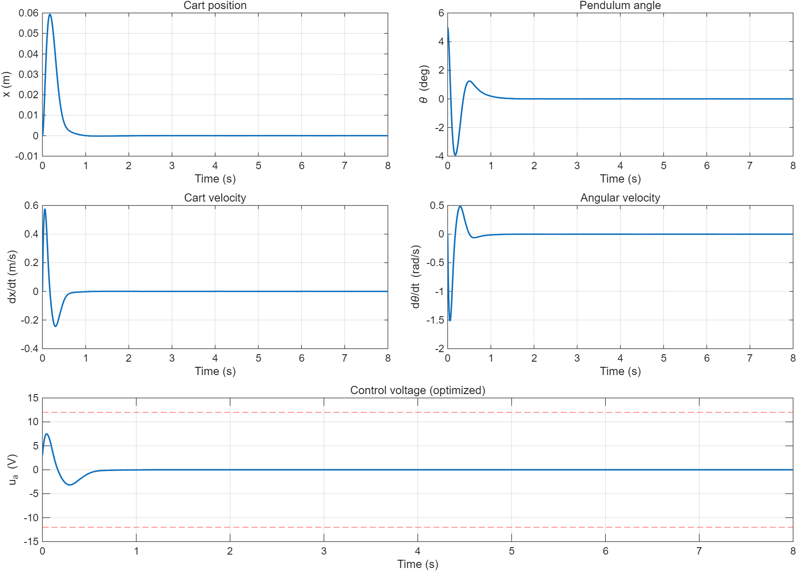
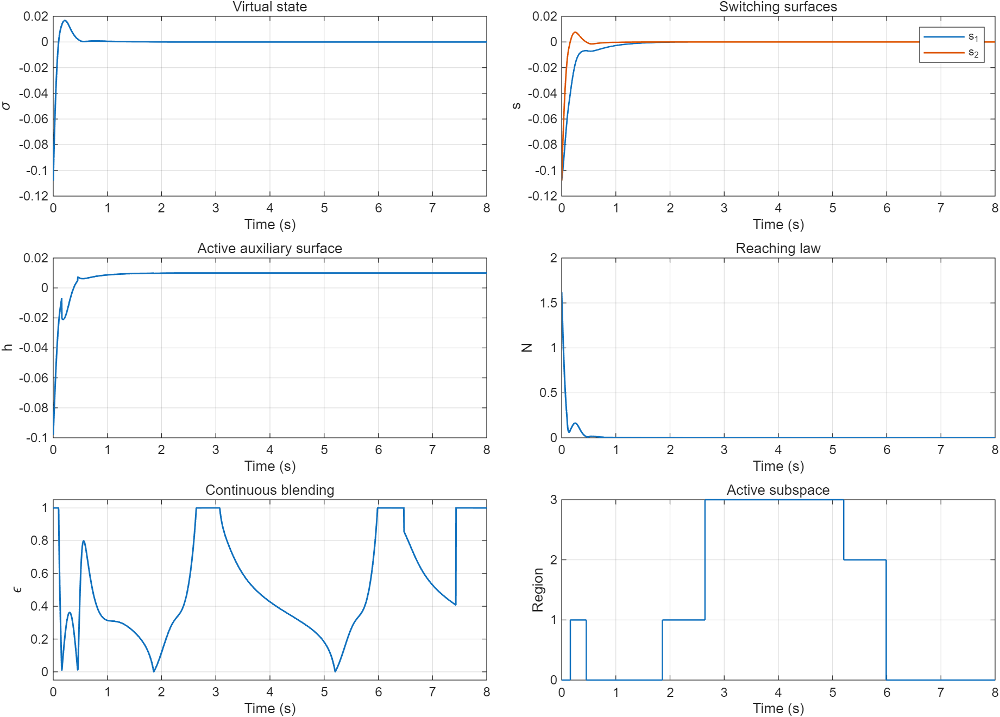
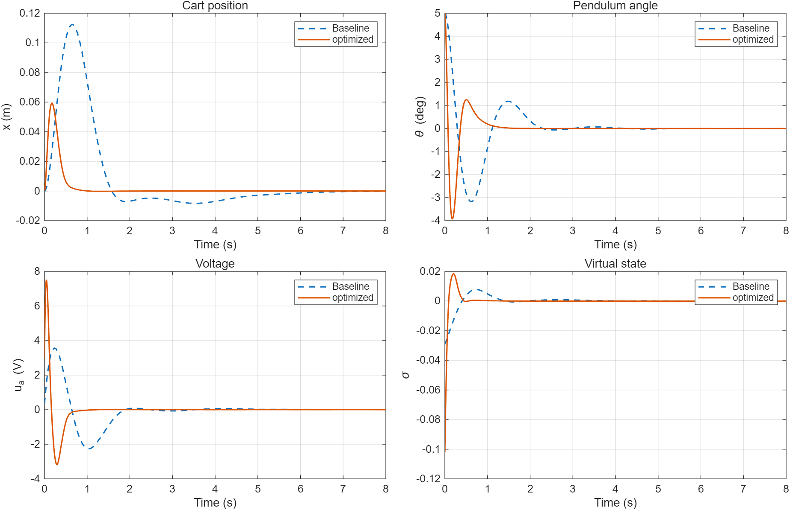
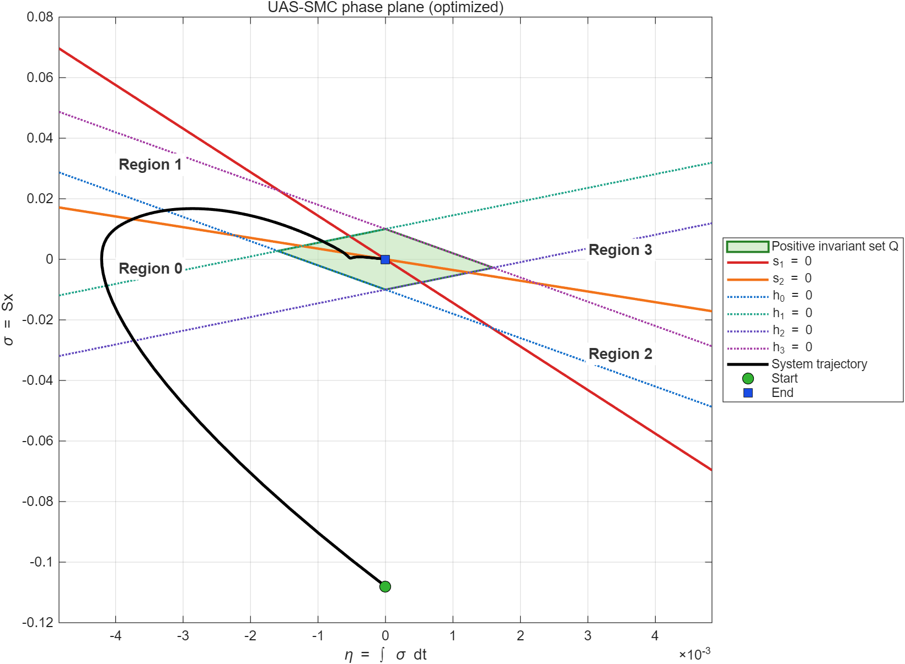
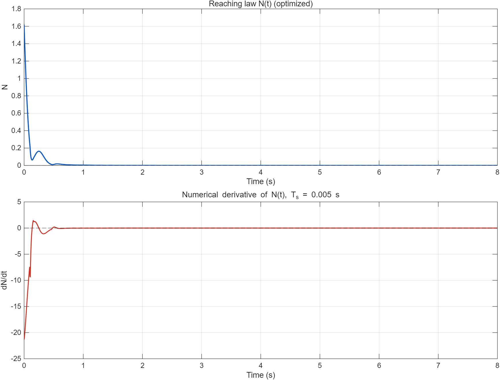
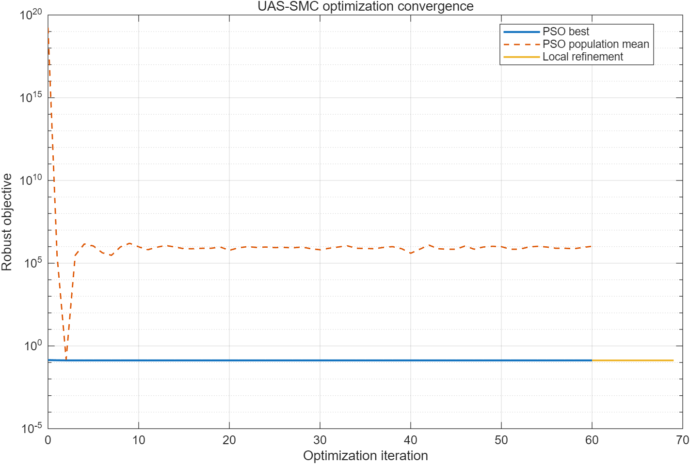

# 仿真结果分析

本文分析当前 `results` 目录中保存的优化结果、标准名义仿真和图像。数值来自当前 `.mat` 文件；它们描述的是小角度线性模型上的 MATLAB 结果，不代表实机或任意大角度下的性能。

## 1. 结果生成条件

标准结果使用：

| 项目 | 数值 |
|---|---:|
| 初始状态 | $[0,0,5^\circ,0]^{\mathsf T}$ |
| 采样周期 | $0.005\,\mathrm s$ |
| 采样频率 | $200\,\mathrm{Hz}$ |
| 仿真时间 | $8\,\mathrm s$ |
| 控制器 | `uas_smc_best_params.mat` 中的优化参数 |
| 电压范围 | $[-12,12]\,\mathrm V$ |
| 调节时间误差带 | $\lvert p\rvert<10^{-3}\,\mathrm m$ 且 $\lvert\theta\rvert<0.1^\circ$，并持续到仿真结束 |

`run_uas_smc_sim.m` 在同一次运行中还计算基线响应，便于与优化控制器比较。

## 2. 名义响应的主要数值

| 指标 | 基线控制器 | 优化控制器 | 解释 |
|---|---:|---:|---|
| 调节时间 | $6.25\,\mathrm s$ | $1.16\,\mathrm s$ | 优化后明显缩短 |
| 峰值位置 | $0.112356\,\mathrm m$ | $0.0593189\,\mathrm m$ | 优化后小车行程峰值约降低 $47.2\%$ |
| 峰值摆角 | $5^\circ$ | $5^\circ$ | 两者均未超过初始角 |
| 峰值电压 | $3.56109\,\mathrm V$ | $7.49996\,\mathrm V$ | 优化器用更大的早期控制换取更快收敛 |
| 电压均方根 | $0.912134\,\mathrm V$ | $0.876733\,\mathrm V$ | 优化控制器虽然峰值更高，但总体能量型指标略低 |
| 电压差分均方根 | $0.0195141\,\mathrm V$ | $0.0639095\,\mathrm V$ | 优化后的相邻采样控制变化更快 |
| 位置 IAE | $0.115832\,\mathrm{m\,s}$ | $0.0173805\,\mathrm{m\,s}$ | 位置累计绝对误差大幅下降 |
| 摆角 IAE | $0.0583137\,\mathrm{rad\,s}$ | $0.0242298\,\mathrm{rad\,s}$ | 摆角累计绝对误差下降 |
| 最终位置 | $-1.12457\times10^{-4}\,\mathrm m$ | $-8.82\times10^{-15}\,\mathrm m$ | 优化结果在数值精度内接近零 |
| 最终摆角 | $-0.00117059^\circ$ | $-1.24\times10^{-12}\,{}^\circ$ | 优化结果在数值精度内接近零 |
| 饱和比例 | 0 | 0 | 名义轨迹均未触发限幅 |
| 最小 $N$ | $8.36\times10^{-6}$ | $2.92\times10^{-16}$ | 采样点上均未观察到 $N<0$ |

名义工况中，优化控制器的主要收益是更短的调节时间、更小的小车位移和更低的累计误差；代价是初始峰值电压和逐采样电压变化更大。不能只看调节时间就断言“所有指标都更优”。

## 3. 鲁棒优化结果

当前正式优化配置为 40 个粒子、60 轮 PSO，随后进行了 9 轮有效的局部搜索记录。结果为：

| 项目 | 结果 |
|---|---:|
| 基线训练目标 | $6.89694\times10^{20}$ |
| 最优训练目标 | $0.1333173$ |
| 基线训练可行工况 | 5/16 |
| 最优参数训练可行工况 | 16/16 |
| 独立验证可行工况 | 97/100 |
| 验证目标（含罚值） | $3.000463\times10^6$ |

基线在名义 $5^\circ$ 工况下能够稳定，但在部分 $\pm10\%$ 参数摄动训练工况中发散，导致状态和未饱和电压需求极大，所以其鲁棒训练目标很高。这与 `baseline_vs_optimized.png` 中“名义基线能收敛”并不矛盾：两者对应的工况集合不同。

最优参数在 16 个训练工况中全部可行，但 100 个独立验证工况有 3 个未通过。失败工况为第 15、45、77 个，具体为：

| 验证序号 | 峰值位置 / m | 峰值摆角 / deg | 未饱和峰值电压 / V | 调节时间 / s | 失败原因 |
|---:|---:|---:|---:|---:|---|
| 15 | 0.0961454 | 7.03347 | 12.3817 | 1.260 | $\lvert u^*\rvert>12\,\mathrm V$ |
| 45 | 0.0916943 | 6.72964 | 12.1593 | 1.190 | $\lvert u^*\rvert>12\,\mathrm V$ |
| 77 | 0.0927270 | 7.28680 | 12.0149 | 1.395 | $\lvert u^*\rvert>12\,\mathrm V$ |

这 3 个工况的状态仍回到终值误差带，$N$ 也没有违反阈值；不通过的原因是理论控制需求超过了 $12\,\mathrm V$，实际输入会被限幅。由于饱和后 $\dot\sigma=\phi$ 不再严格成立，优化器把它们判为不可行是合理的。

100 个验证工况的整体极值为：

| 指标 | 验证集合极值 |
|---|---:|
| 最大峰值位置 | $0.0961454\,\mathrm m$ |
| 最大峰值摆角 | $7.83018^\circ$ |
| 最大限幅后电压 | $12\,\mathrm V$ |
| 最大未饱和电压需求 | $12.3817\,\mathrm V$ |
| 最大调节时间 | $1.605\,\mathrm s$ |
| 最小 $N$ | $6.41\times10^{-19}$ |

因此当前准确表述应是“训练集通过率 100%，独立随机验证通过率 97%”，而不是“所有摄动工况均满足约束”。

## 4. `uas_smc_response.png`：物理状态与控制电压

该图用于回答“控制器是否完成基本稳摆任务”：

- 小车位置先正向移动以产生恢复摆杆所需的加速度，约在 $0.17\,\mathrm s$ 附近达到 $0.0593\,\mathrm m$ 峰值，随后回到原点；
- 摆角从 $5^\circ$ 快速反向，出现约 $-4^\circ$ 的过渡峰值，再衰减到零；
- 速度和角速度均为有界衰减响应；
- 电压早期达到约 $7.50\,\mathrm V$，随后反向到约 $-3.2\,\mathrm V$，没有触及 $\pm12\,\mathrm V$ 限幅线；
- 按仓库的联合误差带定义，调节时间为 $1.16\,\mathrm s$。

该图适合判断物理响应、峰值和稳态，但不能单独说明 UAS-SMC 内部几何是否正确。

## 5. `uas_smc_diagnostics.png`：控制器内部变量

六个子图的作用分别为：

| 子图 | 作用 | 当前现象 |
|---|---|---|
| Virtual state | 检查 $\sigma=Sx$ 是否趋于零 | 早期快速变化并在约 $1\,\mathrm s$ 内接近零 |
| Switching surfaces | 检查 $s_1,s_2$ 的变化 | 两者均趋于零，说明 $\eta$ 与 $\sigma$ 共同衰减 |
| Active auxiliary surface | 观察当前区域的 $h$ | 最终趋近 $m_h=0.01$；因为原点处每个 $h_i(0,0)=m_h$，不应期待它趋于零 |
| Reaching law | 检查 $N=\dot h$ 的非负性 | 从正值衰减到数值零，最小值约 $2.92\times10^{-16}$ |
| Continuous blending | 检查 $\varepsilon\in[0,1]$ 的插值 | 在不同几何区域连续变化，没有超出定义范围 |
| Active subspace | 核对控制器使用的区域编号 | 按 $s_1,s_2$ 符号在 0--3 之间切换 |

后段区域编号仍可能变化，是因为 $s_1,s_2$ 已接近数值零，而区域是按符号硬分类的。区域编号跳变本身不等于控制电压发生抖振；判断控制抖振应同时观察 $\phi$、$u$ 和采样/硬件频谱。

## 6. `baseline_vs_optimized.png`：优化效果对比

该图把同一个名义 $5^\circ$ 工况下的基线与优化控制器放在一起，用于隔离“参数整定”带来的变化：

- 优化控制器的小车峰值更小，回零明显更快；
- 优化摆角虽然早期也有反向过渡，但振荡持续时间更短；
- 优化控制器使用更高的初始峰值电压；
- 基线虚拟状态衰减慢，并伴随更长时间的低幅变化；
- 优化控制器的名义总体电压均方根略低，但逐采样变化均方根更高。

该图用于比较名义响应，不代表基线和优化控制器在参数摄动集合上的通过率；鲁棒性结论必须结合训练与验证数据。

## 7. `uas_smc_phase_plane.png`：切换面、辅助面与正不变集

该图用于验证控制器几何，而不仅是展示一条收敛轨迹：

- 横轴为 $\eta=\int\sigma\,dt$，纵轴为 $\sigma=Sx$；
- 红色和橙色实线是 $s_1=0$、$s_2=0$；
- 四条点线是 $h_0=0$ 至 $h_3=0$；
- 绿色半透明区域是 $Q=\{(\sigma,\eta)\mid h_i\ge0\}$；
- `Region 0`--`Region 3` 标签对应控制器实际的 $(s_1,s_2)$ 符号；
- 黑色轨迹从绿色起点出发，进入 $Q$ 后趋向蓝色终点；
- 四个辅助面交点交替位于两条切换面上，而不是任意组成一个平行四边形。

标准初值 $\eta(0)=0$，由当前 $S$ 和 $5^\circ$ 摆角得到 $\sigma(0)\approx-0.102$。轨迹先在 $Q$ 外运动，随后进入正不变集并趋向原点，和理论设计目的相符。

这张图能检查几何关系和轨迹趋势，但“图上看起来相交”不是充分证明。代码还通过 `switchingResidual` 和自动化测试验证交点残差小于 $10^{-12}$。

## 8. `uas_smc_reaching_law.png`：$N$ 与数值 $\dot N$

上图显示 $N(t)$，用于检查理论要求的 $N\ge0$。当前名义结果中，$N$ 从约 1.5 衰减到数值零，没有出现低于容差的负值。

下图显示

$$
\dot N_k\approx\operatorname{gradient}(N_k,T_s),
$$

它是仿真结束后由 200 Hz 数据计算的数值导数，不参与控制器。$\dot N$ 早期出现负值只表示 $N$ 正在下降，不违反 $N\ge0$。因此不能把“$\dot N<0$”误判为趋近条件失败。

该图的主要用途是区分：

- $N$ 的符号是否满足辅助面导数条件；
- $N$ 的变化是否平滑、是否存在明显的采样尖峰；
- 但它不能替代分区 Lyapunov 证明。

## 9. `optimization_convergence.png`：优化过程

图使用对数纵轴，包含 PSO 最优值、群体均值和局部搜索：

- 初始粒子群的最好目标约为 $0.1403603$；
- 60 轮 PSO 后最好目标为 $0.1333238$；
- 局部搜索进一步改进到 $0.1333173$；
- 群体均值长期远高于最优值，是因为许多粒子违反约束并获得 $10^6$ 或更大的罚值；
- 最优曲线改善幅度不大但保持可行，说明搜索早期已经找到较好区域；
- $\xi_1-\xi_2$ 与 $k$ 达到搜索上界，提示当前边界可能限制了进一步搜索。

该图能说明优化过程和罚函数分布，不能证明粒子群找到了全局最优解。

## 10. 两个 MAT 文件组的作用

### 10.1 `uas_smc_best_params.mat` 与 `optimization_history.mat`

这两个文件用于复现参数整定：

- `best_ctrl`：可直接供标准仿真读取的控制器结构；
- `best_q`：七维优化向量；
- `optimization_report.metadata`：粒子数、迭代数、随机种子和工况数；
- `baseline`、`best`：训练目标及逐工况评估；
- `validation`：独立验证目标、逐工况指标和通过率；
- `history`：PSO 与局部搜索历史。

`optimization_history.mat` 保存 `optimization_report` 的独立副本，主要便于只分析优化过程而不依赖控制参数加载逻辑。

### 10.2 `uas_smc_results.mat`

该文件用于复现标准名义仿真和重新绘图，包含：

- 名义物理参数、$A$、$B$ 和可控矩阵；
- 本次 `simulation_options`；
- 基线和选定控制器的完整时序响应；
- $S$、内部极点、控制器参数；
- $\sigma,s_1,s_2,\varepsilon,\phi,N,h$、区域编号和饱和信息；
- 调节时间、峰值、IAE、电压统计等指标。

图片适合快速观察，MAT 文件才是重新计算指标、排查具体采样点和进行二次分析的依据。

## 11. 自动化测试结果的作用

当前测试套件包含 10 项。它的作用不是重复画图，而是对以下容易被视觉结果掩盖的问题做数值检查：

- 模型矩阵和状态顺序是否被意外改动；
- $S$ 是否仍满足 $SB=1$，内部极点是否正确；
- 控制器是否保持奇对称和原点平衡；
- 切换边界附近的 $\phi$ 是否连续；
- 辅助面顶点是否真正位于切换面；
- 快速优化是否保持参数约束且不劣于基线；
- 正式参数、结果文件和验证通过率是否达到仓库阈值。

测试通过表示“当前实现满足既定回归与验收条件”，不表示已经验证实机、任意噪声、任意采样周期或全局稳定性。

## 12. 综合结论

当前结果支持以下结论：

1. 在名义 $5^\circ$ 小角度工况下，优化 UAS-SMC 在 $1.16\,\mathrm s$ 内进入联合误差带，峰值位置为 $0.0593\,\mathrm m$，峰值电压为 $7.50\,\mathrm V$，没有发生饱和；
2. 与名义基线相比，优化参数显著缩短调节时间并降低位置/角度累计误差，但提高了初始电压峰值和逐采样电压变化；
3. 辅助面顶点满足论文的切换面交点约束，名义轨迹进入所画正不变集并趋向原点；
4. 16 个训练工况全部可行，100 个独立验证工况中 97 个可行；3 个失败均由未饱和电压需求略超 $12\,\mathrm V$ 引起；
5. 当前结果是小角度线性模型、200 Hz 数字仿真和有限随机摄动下的数值证据，不能扩展为实机或任意条件下的全局稳定性结论。
